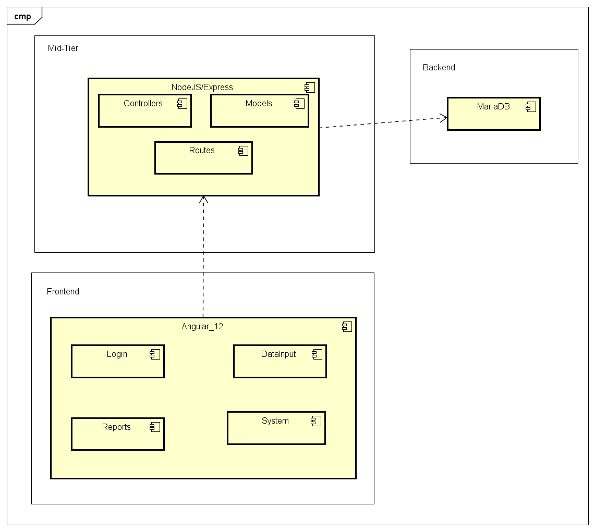
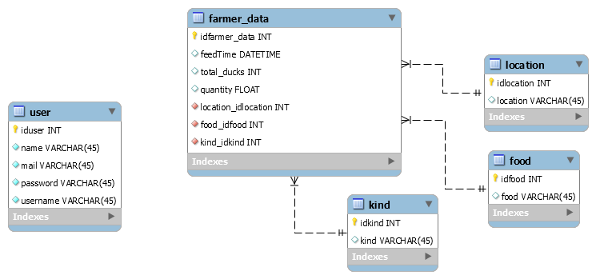

# feed-time-backend

## Overview

Backend/Mid-Tier responsible for the project Feed-Time, presented to study on how Ducks are feed on parks arround the world.

To more information visit the Fronted repository on:

[feed-time-frontend](https://github.com/fgguilherme/feed-time-frontend)

## System Components

## DB Models

## Install dependencies

* MySQL (10.3.25-MariaDB-0ubuntu0.20.04.1 Ubuntu 20.04)
* Node (used 14.15.1)
* npm (used 6.14.18)
* pm2
* Postman (tests)

## Install process

1) Visit Docs folder on this repo and upload the initial SQL file to your MySQL
2) Update config files under config folder
   * DB:
      * host      -> Your MySQL Host - Usually Localhost
      * user      -> MySQL username
      * password  -> password to MySQL user set on config file
      * database
   * Server:
     * port -> Port that the service will run
     * passkey -> Passphrase to Crypto
3) run `npm install`

##  Run

You can run locally, 
* to debug running the command:
`npm start`
* to deploy running the command:
`pm2 start --name "feed-time-backend" -- server`

## Test

to help test the environment, is provided a Postman collection under Docs folder.

## 10H Commit

The 10H commit is discribed at the TAG 10H 